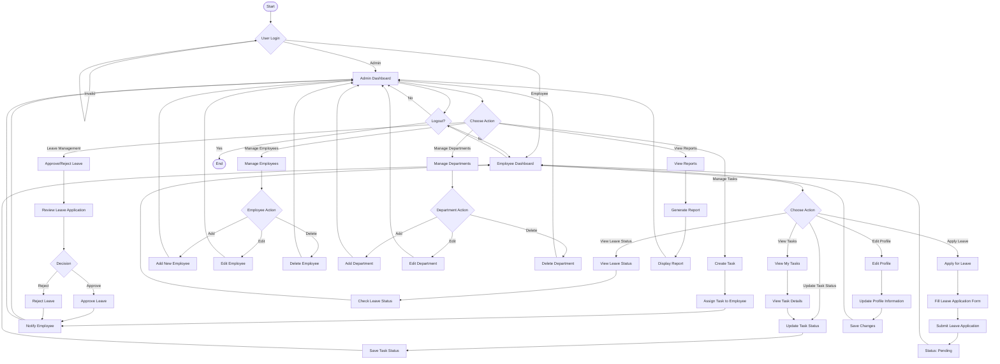

# Activity Diagram - Task Management System

```mermaid
flowchart TD
    Start([Start]) --> Login{User Login}
    Login -->|Admin| AdminDashboard[Admin Dashboard]
    Login -->|Employee| UserDashboard[Employee Dashboard]
    Login -->|Invalid| Login
    
    AdminDashboard --> AdminChoice{Choose Action}
    AdminChoice -->|Manage Tasks| CreateTask[Create Task]
    AdminChoice -->|Manage Employees| ManageEmp[Manage Employees]
    AdminChoice -->|Manage Departments| ManageDept[Manage Departments]
    AdminChoice -->|Leave Management| ManageLeave[Approve/Reject Leave]
    AdminChoice -->|View Reports| ViewReports[View Reports]
    
    UserDashboard --> UserChoice{Choose Action}
    UserChoice -->|View Tasks| ViewTasks[View My Tasks]
    UserChoice -->|Update Task Status| UpdateTask[Update Task Status]
    UserChoice -->|Apply Leave| ApplyLeave[Apply for Leave]
    UserChoice -->|View Leave Status| ViewLeaveStatus[View Leave Status]
    UserChoice -->|Edit Profile| EditProfile[Edit Profile]
    
    CreateTask --> AssignTask[Assign Task to Employee]
    AssignTask --> NotifyEmployee[Notify Employee]
    NotifyEmployee --> AdminDashboard
    
    ManageEmp --> EmpChoice{Employee Action}
    EmpChoice -->|Add| AddEmployee[Add New Employee]
    EmpChoice -->|Edit| EditEmployee[Edit Employee]
    EmpChoice -->|Delete| DeleteEmployee[Delete Employee]
    AddEmployee --> AdminDashboard
    EditEmployee --> AdminDashboard
    DeleteEmployee --> AdminDashboard
    
    ManageDept --> DeptChoice{Department Action}
    DeptChoice -->|Add| AddDept[Add Department]
    DeptChoice -->|Edit| EditDept[Edit Department]
    DeptChoice -->|Delete| DeleteDept[Delete Department]
    AddDept --> AdminDashboard
    EditDept --> AdminDashboard
    DeleteDept --> AdminDashboard
    
    ManageLeave --> ReviewLeave[Review Leave Application]
    ReviewLeave --> LeaveDecision{Decision}
    LeaveDecision -->|Approve| ApproveLeave[Approve Leave]
    LeaveDecision -->|Reject| RejectLeave[Reject Leave]
    ApproveLeave --> NotifyEmployee
    RejectLeave --> NotifyEmployee
    NotifyEmployee --> AdminDashboard
    
    ViewTasks --> TaskDetail[View Task Details]
    TaskDetail --> UpdateTask
    UpdateTask --> SaveStatus[Save Task Status]
    SaveStatus --> UserDashboard
    
    ApplyLeave --> FillForm[Fill Leave Application Form]
    FillForm --> SubmitLeave[Submit Leave Application]
    SubmitLeave --> PendingStatus[Status: Pending]
    PendingStatus --> UserDashboard
    
    ViewLeaveStatus --> CheckStatus[Check Leave Status]
    CheckStatus --> UserDashboard
    
    EditProfile --> UpdateProfile[Update Profile Information]
    UpdateProfile --> SaveProfile[Save Changes]
    SaveProfile --> UserDashboard
    
    ViewReports --> GenerateReport[Generate Report]
    GenerateReport --> DisplayReport[Display Report]
    DisplayReport --> AdminDashboard
    
    AdminDashboard --> Logout{Logout?}
    UserDashboard --> Logout
    Logout -->|Yes| End([End])
    Logout -->|No| AdminDashboard
    Logout -->|No| UserDashboard
```

