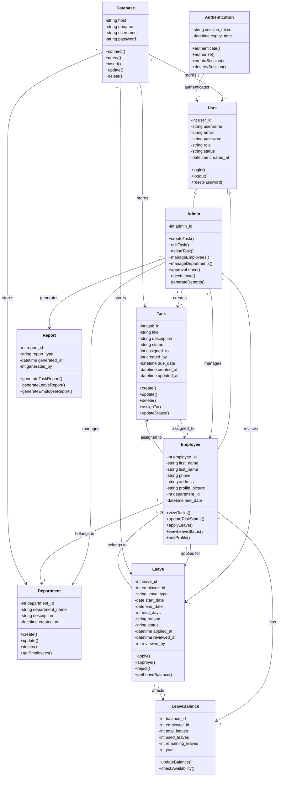

# Class Diagram - Task Management System

```mermaid
classDiagram
    class User {
        -int user_id
        -string username
        -string email
        -string password
        -string role
        -string status
        -datetime created_at
        +login()
        +logout()
        +resetPassword()
    }
    
    class Admin {
        -int admin_id
        +createTask()
        +editTask()
        +deleteTask()
        +manageEmployees()
        +manageDepartments()
        +approveLeave()
        +rejectLeave()
        +generateReports()
    }
    
    class Employee {
        -int employee_id
        -string first_name
        -string last_name
        -string phone
        -string address
        -string profile_picture
        -int department_id
        -datetime hire_date
        +viewTasks()
        +updateTaskStatus()
        +applyLeave()
        +viewLeaveStatus()
        +editProfile()
    }
    
    class Task {
        -int task_id
        -string title
        -string description
        -string status
        -int assigned_to
        -int created_by
        -datetime due_date
        -datetime created_at
        -datetime updated_at
        +create()
        +update()
        +delete()
        +assignTo()
        +updateStatus()
    }
    
    class Department {
        -int department_id
        -string department_name
        -string description
        -datetime created_at
        +create()
        +update()
        +delete()
        +getEmployees()
    }
    
    class Leave {
        -int leave_id
        -int employee_id
        -string leave_type
        -date start_date
        -date end_date
        -int total_days
        -string reason
        -string status
        -datetime applied_at
        -datetime reviewed_at
        -int reviewed_by
        +apply()
        +approve()
        +reject()
        +getLeaveBalance()
    }
    
    class LeaveBalance {
        -int balance_id
        -int employee_id
        -int total_leaves
        -int used_leaves
        -int remaining_leaves
        -int year
        +updateBalance()
        +checkAvailability()
    }
    
    class Report {
        -int report_id
        -string report_type
        -datetime generated_at
        -int generated_by
        +generateTaskReport()
        +generateLeaveReport()
        +generateEmployeeReport()
    }
    
    class Database {
        -string host
        -string dbname
        -string username
        -string password
        +connect()
        +query()
        +insert()
        +update()
        +delete()
    }
    
    class Authentication {
        -string session_token
        -datetime expiry_time
        +authenticate()
        +authorize()
        +createSession()
        +destroySession()
    }
    
    User <|-- Admin
    User <|-- Employee
    Admin "1" --> "*" Task : creates
    Admin "1" --> "*" Employee : manages
    Admin "1" --> "*" Department : manages
    Admin "1" --> "*" Leave : reviews
    Admin "1" --> "*" Report : generates
    Employee "1" --> "*" Task : assigned to
    Employee "1" --> "*" Leave : applies for
    Employee "1" --> "1" Department : belongs to
    Employee "1" --> "1" LeaveBalance : has
    Task "1" --> "1" Employee : assigned_to
    Leave "1" --> "1" Employee : belongs to
    Leave "1" --> "1" LeaveBalance : affects
    Database "1" --> "*" User : stores
    Database "1" --> "*" Task : stores
    Database "1" --> "*" Department : stores
    Database "1" --> "*" Leave : stores
    Authentication "1" --> "*" User : authenticates
```

