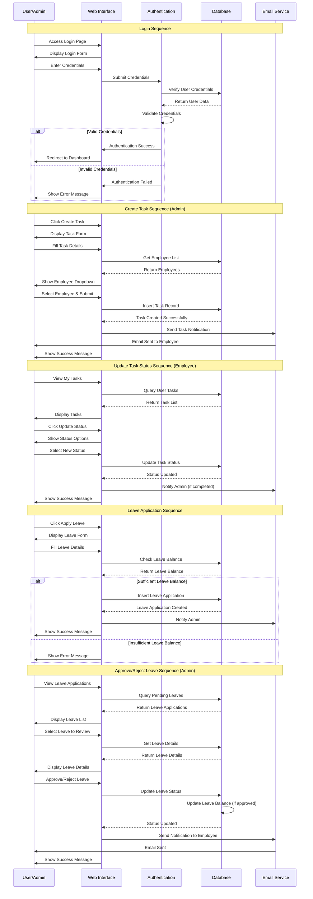

# Sequence Diagram - Task Management System

```mermaid
sequenceDiagram
    participant User as User/Admin
    participant UI as Web Interface
    participant Auth as Authentication
    participant DB as Database
    participant Email as Email Service
    
    Note over User,Email: Login Sequence
    User->>UI: Access Login Page
    UI->>User: Display Login Form
    User->>UI: Enter Credentials
    UI->>Auth: Submit Credentials
    Auth->>DB: Verify User Credentials
    DB-->>Auth: Return User Data
    Auth->>Auth: Validate Credentials
    alt Valid Credentials
        Auth->>UI: Authentication Success
        UI->>User: Redirect to Dashboard
    else Invalid Credentials
        Auth->>UI: Authentication Failed
        UI->>User: Show Error Message
    end
    
    Note over User,Email: Create Task Sequence (Admin)
    User->>UI: Click Create Task
    UI->>User: Display Task Form
    User->>UI: Fill Task Details
    UI->>DB: Get Employee List
    DB-->>UI: Return Employees
    UI->>User: Show Employee Dropdown
    User->>UI: Select Employee & Submit
    UI->>DB: Insert Task Record
    DB-->>UI: Task Created Successfully
    UI->>Email: Send Task Notification
    Email->>User: Email Sent to Employee
    UI->>User: Show Success Message
    
    Note over User,Email: Update Task Status Sequence (Employee)
    User->>UI: View My Tasks
    UI->>DB: Query User Tasks
    DB-->>UI: Return Task List
    UI->>User: Display Tasks
    User->>UI: Click Update Status
    UI->>User: Show Status Options
    User->>UI: Select New Status
    UI->>DB: Update Task Status
    DB-->>UI: Status Updated
    UI->>Email: Notify Admin (if completed)
    UI->>User: Show Success Message
    
    Note over User,Email: Leave Application Sequence
    User->>UI: Click Apply Leave
    UI->>User: Display Leave Form
    User->>UI: Fill Leave Details
    UI->>DB: Check Leave Balance
    DB-->>UI: Return Leave Balance
    alt Sufficient Leave Balance
        UI->>DB: Insert Leave Application
        DB-->>UI: Leave Application Created
        UI->>Email: Notify Admin
        UI->>User: Show Success Message
    else Insufficient Leave Balance
        UI->>User: Show Error Message
    end
    
    Note over User,Email: Approve/Reject Leave Sequence (Admin)
    User->>UI: View Leave Applications
    UI->>DB: Query Pending Leaves
    DB-->>UI: Return Leave Applications
    UI->>User: Display Leave List
    User->>UI: Select Leave to Review
    UI->>DB: Get Leave Details
    DB-->>UI: Return Leave Details
    UI->>User: Display Leave Details
    User->>UI: Approve/Reject Leave
    UI->>DB: Update Leave Status
    DB->>DB: Update Leave Balance (if approved)
    DB-->>UI: Status Updated
    UI->>Email: Send Notification to Employee
    Email->>User: Email Sent
    UI->>User: Show Success Message
```

