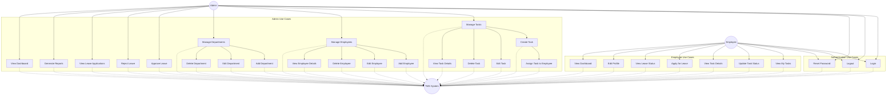

# Use Case Diagram - Task Management System

```mermaid
graph TB
    Admin((Admin))
    Employee((Employee))
    System((TMS System))
    
    subgraph "Authentication Use Cases"
        UC1[Login]
        UC2[Logout]
        UC3[Reset Password]
    end
    
    subgraph "Admin Use Cases"
        UC4[Manage Tasks]
        UC5[Create Task]
        UC6[Edit Task]
        UC7[Delete Task]
        UC8[View Task Details]
        UC9[Assign Task to Employee]
        UC10[Manage Employees]
        UC11[Add Employee]
        UC12[Edit Employee]
        UC13[Delete Employee]
        UC14[View Employee Details]
        UC15[Manage Departments]
        UC16[Add Department]
        UC17[Edit Department]
        UC18[Delete Department]
        UC19[Approve Leave]
        UC20[Reject Leave]
        UC21[View Leave Applications]
        UC22[Generate Reports]
        UC23[View Dashboard]
    end
    
    subgraph "Employee Use Cases"
        UC24[View My Tasks]
        UC25[Update Task Status]
        UC26[View Task Details]
        UC27[Apply for Leave]
        UC28[View Leave Status]
        UC29[Edit Profile]
        UC30[View Dashboard]
    end
    
    Admin --> UC1
    Employee --> UC1
    Admin --> UC2
    Employee --> UC2
    Admin --> UC3
    Employee --> UC3
    
    Admin --> UC4
    UC4 --> UC5
    UC4 --> UC6
    UC4 --> UC7
    UC4 --> UC8
    UC5 --> UC9
    
    Admin --> UC10
    UC10 --> UC11
    UC10 --> UC12
    UC10 --> UC13
    UC10 --> UC14
    
    Admin --> UC15
    UC15 --> UC16
    UC15 --> UC17
    UC15 --> UC18
    
    Admin --> UC19
    Admin --> UC20
    Admin --> UC21
    Admin --> UC22
    Admin --> UC23
    
    Employee --> UC24
    Employee --> UC25
    Employee --> UC26
    Employee --> UC27
    Employee --> UC28
    Employee --> UC29
    Employee --> UC30
    
    UC1 -.-> System
    UC2 -.-> System
    UC3 -.-> System
    UC4 -.-> System
    UC5 -.-> System
    UC6 -.-> System
    UC7 -.-> System
    UC8 -.-> System
    UC9 -.-> System
    UC10 -.-> System
    UC11 -.-> System
    UC12 -.-> System
    UC13 -.-> System
    UC14 -.-> System
    UC15 -.-> System
    UC16 -.-> System
    UC17 -.-> System
    UC18 -.-> System
    UC19 -.-> System
    UC20 -.-> System
    UC21 -.-> System
    UC22 -.-> System
    UC23 -.-> System
    UC24 -.-> System
    UC25 -.-> System
    UC26 -.-> System
    UC27 -.-> System
    UC28 -.-> System
    UC29 -.-> System
    UC30 -.-> System
```

